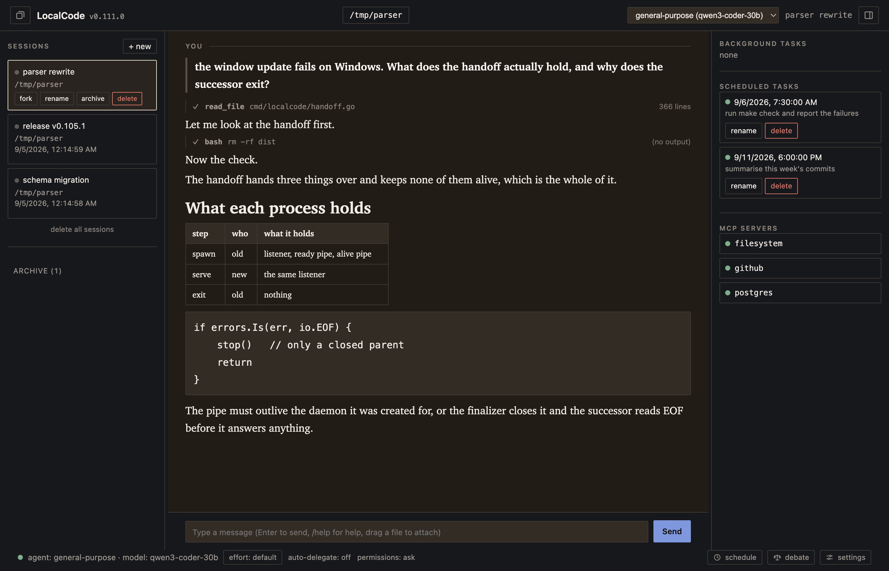
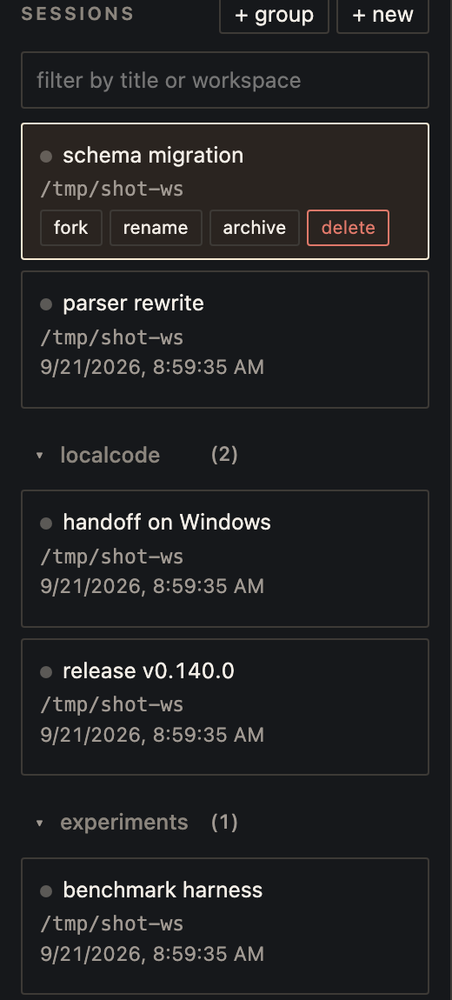

<p align="center">
  
</p>

<h1 align="center">localcode</h1>

<p align="center">
  A coding agent that runs on your machine, on any model —<br>
  and lets a second model check the first.
</p>

<p align="center">
  <a href="https://github.com/dennis2lee/localcode/releases/latest">Download</a> ·
  <a href="#install">Install</a> ·
  <a href="https://dennis2lee.github.io/localcode/where-localcode-differs.html">Where it differs</a> ·
  <a href="https://dennis2lee.github.io/localcode/coding-agent-benchmark.html">Benchmark</a> ·
  <a href="docs/USAGE.md">Manual</a>
</p>

<p align="center">
  
</p>

## Why another coding agent



Every coding agent runs one model in one loop and asks it to review its own work. localcode is built around what that loop cannot do.

**Reviewers that do not share a brain.** [`/debate`](https://dennis2lee.github.io/localcode/where-localcode-differs.html#debate) hands your change to up to three reviewers, each a separate agent on its own model, none able to see the others. Nothing ships until all of them say yes. Put Claude, a local Qwen and GPT on the panel and you get disagreement instead of a model agreeing with itself.

**Work that runs when you said, not when you sent it.** `tomorrow at 9am run the full test suite and summarise only the failures` is [booked](https://dennis2lee.github.io/localcode/where-localcode-differs.html#scheduled), the time parsed by localcode rather than guessed at by the model. Korean works too. A time that passes while localcode is closed is reported as missed, not run late.

**Plans checked before a token is spent.** [Orchestrate](https://dennis2lee.github.io/localcode/where-localcode-differs.html#orchestrate) makes a multi-agent plan structured data. Every agent named, every stage reference and every count is validated whole, and a plan that would not work is refused with the reason — not narrated and abandoned halfway.

**Any model, hosted or on your own machine, in one conversation.** Bedrock, the Anthropic API and anything OpenAI-compatible — LM Studio, vLLM, llama.cpp, Ollama — with [switching mid-conversation](https://dennis2lee.github.io/localcode/where-localcode-differs.html#model-switch). [Local runtimes](https://dennis2lee.github.io/localcode/where-localcode-differs.html#local-models) get both spellings of the reasoning field, the context window the server actually loaded, and failover to another profile.

**You can see what the model will see.** [`/context`](https://dennis2lee.github.io/localcode/where-localcode-differs.html#prompt-inventory) reports the next request piece by piece — source, trust class, token estimate — without a model call. Another conversation reaches this one only through [`#name`](https://dennis2lee.github.io/localcode/where-localcode-differs.html#reference), as a tool result the model asked for, never spliced into your prompt.

## On the same model

Twenty-five SWE-bench Verified instances, one model, four agents. Claude Code resolved 19; localcode resolved 19 with Smart Agent off and 21 with it on. That spread is inside run-to-run variance, so [the benchmark](https://dennis2lee.github.io/localcode/coding-agent-benchmark.html) does not rank them. What it shows is that pointing an agent at your own model, with reviewers and schedules and validated plans on top, gives nothing up.

## It reads what you already have

`CLAUDE.md` and `AGENTS.md` with `@path` imports; skills and commands from `.claude`, `.opencode` or `.localcode`; your Claude Code MCP servers via `localcode mcp import-claude`; an `opencode.json` as it is. One daemon serves a terminal client, a browser client and a native window at once — run it on the box with the GPU, attach from a laptop.

## Install

One static binary, no root, nothing written outside `$HOME`:

```bash
curl -fsSL https://raw.githubusercontent.com/dennis2lee/localcode/main/scripts/install.sh | sh
```

Windows MSI, macOS app and Debian packages are on the [releases page](https://github.com/dennis2lee/localcode/releases/latest); every other way is in [INSTALL.md](docs/INSTALL.md). Then:

```bash
mkdir -p ~/.localcode && cp config.example.json ~/.localcode/config.json
localcode
```

Point the config at a model — a Bedrock region, an Anthropic key, or a local server's address — and open `http://127.0.0.1:4096` for the browser client. [MODELS.md](docs/MODELS.md) has verified model IDs per provider.

## Read on

| | |
|---|---|
| [Where localcode differs](https://dennis2lee.github.io/localcode/where-localcode-differs.html) | Fourteen capabilities, the use case for each, and what is deliberately the same as elsewhere · [한국어](https://dennis2lee.github.io/localcode/where-localcode-differs.ko.html) |
| [Coding agents on one model](https://dennis2lee.github.io/localcode/coding-agent-benchmark.html) | The SWE-bench run above: setup, per-instance results, and the one instance every agent failed |
| [FEATURES.md](docs/FEATURES.md) | Everything localcode ships, one line each |
| [USAGE.md](docs/USAGE.md) | The manual: configuration, commands, sessions, agents |
| [API.md](docs/API.md) | The HTTP and SSE API the front ends use |
| [CHANGELOG.md](docs/CHANGELOG.md) | What changed, and what the reviews of it found |

MIT. Packages are unsigned; the installer verifies SHA-256. The native window is experimental, and there is none on Linux — the daemon, terminal and browser clients are.
